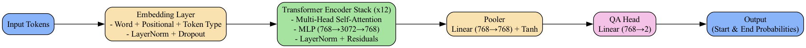
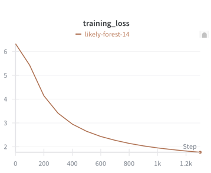

# RoBERTa for MLM and Question Answering

[](https://huggingface.co/detker/roberta-qa-125M)


<p align="center"><i>Simplified architecture of RoBERTa for QA task</i></p>

## 📋 Table of Contents

- [Introduction](#introduction)
- [Setup](#setup)
- [Training](#training)
- [Inference and Demo](#-inference-and-demo)

## 🔎 Introduction

This repository implements a RoBERTa-based model fine-tuned with LoRA (Low-Rank Adaptation) for question answering tasks. The QA model is deployed as a containerized FastAPI service (Docker Hub + HuggingFace Spaces). The project uses Hugging Face's `transformers` library and the `accelerate` framework for efficient training and evaluation. It also includes a RoBERTa MLM training script in case you want to train your own base RoBERTa instead of using pretrained Hugging Face weights.

### Highlights
- **Question Answering**: Designed for extractive QA tasks.
- **LoRA Fine-Tuning**: Efficiently fine-tune large models with low-rank adaptation for QA.
- **Masked Language Modeling**: Designed as base for MLM tasks.
- **Customizable Training**: Easily modify hyperparameters and configurations.
- **Pretrained Weights**: Leverages pretrained RoBERTa models for initialization.
- **Distributed Data Parallelism**: Training can be performed on a multi-GPU setup using the `accelerate` library.
- **Deployed API**: QA inference is deployed with FastAPI, Docker, Docker Hub, and HuggingFace Spaces.
- **Ready-to-Go Local Inference**: Supports loading model through Hugging Face's `transformers` library.

### 📂 Project Structure
```
.
├── src/
├── app/
├── inference/
├── wandb/
├── data/
│   ├── roberta_data/
│   └── squad_data/
├── working_directory/
│   ├── mlm_experiment_name/
│   │   └── checkpoints/
│   └── qa_experiment_name/
│       └── checkpoints/
```

### 📦 Model Weights
Pretrained model weights are available on Hugging Face: [RoBERTa QA + LoRA](https://huggingface.co/detker/roberta-qa-125M)

You can load the model using Hugging Face's `AutoModel` and `AutoConfig` classes:

```python
from transformers import AutoModel, AutoConfig, RobertaTokenizerFast
from hf_pretrained_model import RobertaConfigHF, RobertaForQAHF

# Register model
AutoConfig.register('roberta-qa', RobertaConfigHF)
AutoModel.register(RobertaConfigHF, RobertaForQAHF)

# Load config
config = AutoConfig.from_pretrained('detker/roberta-qa-125M')
# Load tokenizer
tokenizer = RobertaTokenizerFast.from_pretrained(config.hf_model_name)
# Load the model
model = AutoModel.from_pretrained('detker/roberta-qa-125M',
                                  trust_remote_code=True)

# Example usage
inputs = tokenizer(
    text=question,
    text_pair=context,
    max_length=config.context_length,
    truncation='only_second',
    return_tensors='pt'
)
start_logits, end_logits = model(**inputs)
```

## ⚙️ Setup

### Prerequisites
Ensure the following dependencies are installed:
- Python 3.11.4
- Conda 23.7.3
- PyTorch (compatible with your hardware)

### Installation
Clone the repository and set up the environment:
```bash
git clone https://github.com/detker/RoBERTa-MLM-QA
cd RoBERTa-MLM-QA
conda create -n roberta_mlmqa python=3.11.4
conda activate roberta_mlmqa
pip install -r requirements.txt
```

### Dataset Preparation
Prepare the dataset (wikipedia + bookcorpus) for base (MLM) using the `prepare_data.py` script:
```bash
python prepare_data.py
```
This will preprocess and save the dataset in the `data/` directory.
Dataset (SQuAD) preparation for QA finetuning with LoRA is already implemented in the training script leveraging Hugging Face's `datasets` library.

## 🚀 Training
The available weights for QA were obtained by fine-tuning on a single GTX 1080 GPU over 3 epochs with a batch size of 64

Below we present loss visualization taken from wandb platform.



Train the base model using the `train_mlm.sh` script. Adjust the parameters in the script as needed. Example:
```bash
chmod +x train_mlm.sh
./train_mlm.sh
```

Train the finetuned model for QA with LoRA using the `train_qa.sh` script. Adjust the parameters in the script as needed. Example:
```bash
chmod +x train_qa.sh
./train_qa.sh
```

The QA training script supports both options: using your own backbone weights trained with `train_mlm.sh`, or loading pretrained Hugging Face RoBERTa weights.

Training QA parameters include:

| **Parameter**               | **Description**                                                                      | **Default**       | **Type**            |
|-----------------------------|--------------------------------------------------------------------------------------|-------------------|---------------------|
| `--experiment_name`         | Name of the experiment being launched                                                | **Required**      | `str`               |
| `--working_directory`       | Directory for checkpoints and logs                                                   | **Required**      | `str`               |
| `--hf_model_name`           | Hugging Face model name or path                                                      | **Required**      | `str`               |
| `--hf_dataset`              | Hugging Face dataset name                                                            | **Required**      | `str`               |
| `--use_lora`                | Whether to use LoRA                                                                  | `False`           | `bool`              |
| `--train_head_only`         | Whether to train only the classification head                                        | `False`           | `bool`              |
| `--lora_rank`               | Rank of the LoRA adaptation matrices                                                 | `8`               | `int`               |
| `--lora_alpha`              | Alpha scaling factor for LoRA                                                        | `8`               | `int`               |
| `--lora_use_rslora`         | Whether to use RS-LoRA                                                               | `False`           | `bool`              |
| `--lora_dropout`            | Dropout rate for LoRA layers                                                         | `0.1`             | `float`             |
| `--lora_bias`               | Bias configuration for LoRA                                                          | `'none'`          | `str` (choices: `none`, `lora_only`, `all`) |
| `--lora_target_modules`     | Comma-separated list of target modules for LoRA                                      | **None**          | `list`              |
| `--lora_exclude_modules`    | Comma-separated list of modules to exclude from LoRA                                 | **None**          | `list`              |
| `--max_grad_norm`           | Maximum norm for gradient clipping                                                   | `1.0`             | `float`             |
| `--per_gpu_batch_size`      | Per GPU batch size                                                                   | `32`              | `int`               |
| `--warmup_steps`            | Number of warmup steps for the learning rate scheduler                               | `0`               | `int`               |
| `--epochs`                  | Number of training epochs                                                            | `3`               | `int`               |
| `--num_workers`             | Number of workers for DataLoader                                                     | `4`               | `int`               |
| `--learning_rate`           | Learning rate for the optimizer                                                      | `5e-5`            | `float`             |
| `--weight_decay`            | Weight decay for the optimizer                                                       | `0.0`             | `float`             |
| `--gradient_checkpointing`  | Whether to use gradient checkpointing                                                | `False`           | `bool`              |
| `--adam_beta1`              | Beta1 parameter for Adam optimizer                                                   | `0.9`             | `float`             |
| `--adam_beta2`              | Beta2 parameter for Adam optimizer                                                   | `0.999`           | `float`             |
| `--adam_epsilon`            | Epsilon parameter for Adam optimizer                                                 | `1e-8`            | `float`             |
| `--seed`                    | Random seed for reproducibility                                                      | `42`              | `int`               |
| `--wandb`                   | Whether to use Weights & Biases for logging                                          | `False`           | `bool`              |
| `--loading_from_checkpoint` | Whether to load weights from the latest checkpoint                                   | `False`           | `bool`              |
| `--max_no_of_checkpoints`   | Max number of latest checkpoints to store on disk                                    | `10`              | `int`               |
| `--path_to_pretrained_backbone` | Path to pretrained backbone weights                                                  | **None**          | `str`               |
| `--pretrained_backbone`     | Type of pretrained backbone to use (`pretrained`, `pretrained_huggingface`, `random`) | **None**          | `str`               |
| `--path_to_cache_dir`       | Path to Hugging Face cache directory                                                 | **None**          | `str`               |

Checkpoints are saved in the `{working_directory}/{experiment_name}/checkpoints/` directory at regular intervals.

## 🌐 Inference and Demo

This project supports both **local** and **non-local (deployed API)** inference.

### 1) Local inference

You can run QA locally by loading the model directly from Hugging Face with `AutoModel.from_pretrained(...)`. The weights are downloaded and cached automatically on first run.

- Model repo: [detker/roberta-qa-125M](https://huggingface.co/detker/roberta-qa-125M)
- Local demo assets: `inference/demo_local.py`, `inference/inference_qa_local.ipynb`

This mode is useful for development, debugging, and offline experiments.

### 2) Non-local inference (API)

The repository also includes an inference service implemented in `app/main.py` using **FastAPI**.

Available endpoints:
- `GET /` — health check
- `GET /predict` — QA inference endpoint

`/predict` accepts:
- `question` (query string)
- `context` (query string)

And returns:
- `start_token_idx` - starting token index of the predicted answer span
- `end_token_idx` - ending token index of the predicted answer span
- `answer` - extracted answer text

### Deployment process

To make inference available remotely, the service was productionized as follows:

1. Implemented FastAPI endpoints in `app/main.py`.
2. Containerized the app with `app/Dockerfile`.
3. Built and pushed the image to Docker Hub.
4. Deployed the container to **Hugging Face Spaces**.
