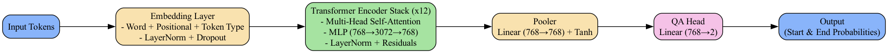

# RoBERTa for MLM and Question Answering with (Q)LoRA

[](https://huggingface.co/detker/roberta-qa-125M)


<p align="center"><i>Simplified architecture of RoBERTa for QA task</i></p>

## 📋 Table of Contents

- [Introduction](#introduction)
- [Setup](#setup)
- [Training](#training)
- [LoRA / QLoRA](#lora--qlora)
- [Evaluation](#evaluation)
- [Notebooks & Demo](#notebooks--demo)
- [Deployment & Hosted Inference](#deployment--hosted-inference)

## 🔎 Introduction

This project implements a RoBERTa-based model fine-tuned with LoRA / QLoRA (Low-Rank Adaptation and its 4-bit quantized variant) for question answering tasks. The project utilizes Hugging Face's `transformers` library and the `accelerate` framework for efficient training and evaluation. The LoRA/QLoRA layers are implemented from scratch in `src/lora.py`. Project is also provided with RoBERTa for MLM training script in case user wants to train his very own base RoBERTa rather than using pretrained Hugging Face's weights.

### Highlights
- **Question Answering**: Designed for extractive QA tasks.
- **LoRA / QLoRA Fine-Tuning**: Efficiently fine-tune with low-rank adaptation, optionally on top of a 4-bit (NF4) quantized backbone - a single `--use_lora` / `--use_qlora` switch picks the variant.
- **Masked Language Modeling**: Designed as base for MLM tasks.
- **Customizable Training**: Easily modify hyperparameters and configurations.
- **Pretrained Weights**: Leverages pretrained RoBERTa models for initialization.
- **Distributed Data Parallelism**: Training can be performed on a multi-GPU setup using the `accelerate` library.
- **Evaluation**: SQuAD-style EM/F1 evaluation and multi-configuration comparison in a notebook.
- **Ready-to-Go Inference**: Loads the published model straight from the Hugging Face Hub via `AutoModel.from_pretrained`.
- **Deployed API**: QA inference is served with FastAPI, containerized with Docker, and deployed to Hugging Face Spaces.

### 📂 Project Structure
```
.
├── src/                # model, LoRA/QLoRA layers, utils
├── inference/          # inference wrapper, demo, evaluation notebook
├── app/                # FastAPI service + Dockerfile for deployment
├── wandb/
├── data/
│   ├── roberta_data/
│   └── squad_data/
└── work_dir/
    └── experiment_name/
        └── checkpoints/
```

### 📦 Model Weights
Pretrained model weights are available on Hugging Face: [RoBERTa QA + LoRA](https://huggingface.co/detker/roberta-qa-125M)

Training writes `safetensors` checkpoints to `work_dir/{experiment_name}/checkpoints/`. For QA with LoRA/QLoRA two kinds are saved per epoch: the trainable adapters only (`checkpoint_{lora|qlora}_{epoch}.safetensors`) and, at the final epoch, a fully **merged** checkpoint with the adapters folded back into the base weights (`checkpoint_merged_{lora|qlora}_{epoch}.safetensors`); the merged checkpoint is what gets published to the Hub.

You can load the model directly from the Hub using Hugging Face's `AutoModel` and `AutoConfig` classes (weights are downloaded and cached automatically on first run):

```python
from transformers import AutoModel, AutoConfig, RobertaTokenizerFast
from hf_pretrained_model import RobertaConfigHF, RobertaForQAHF

# Register model
AutoConfig.register('roberta-qa', RobertaConfigHF)
AutoModel.register(RobertaConfigHF, RobertaForQAHF)

# Load config
config = AutoConfig.from_pretrained('detker/roberta-qa-125M')
# Load tokenizer
tokenizer = RobertaTokenizerFast.from_pretrained(config.hf_model_name)
# Load the model
model = AutoModel.from_pretrained('detker/roberta-qa-125M',
                                  trust_remote_code=True)

# Example usage
inputs = tokenizer(
    text=question,
    text_pair=context,
    max_length=config.context_length,
    truncation='only_second',
    return_tensors='pt'
)
start_logits, end_logits = model(**inputs)
```

## ⚙️ Setup

### Prerequisites
- [uv](https://docs.astral.sh/uv/) (Python package & environment manager)
- A CUDA-capable GPU (required for QLoRA / 4-bit `bitsandbytes`)

### Installation
```bash
uv sync
```
`uv` reads the required Python version from `.python-version` and provisions it automatically. Prefix commands with `uv run` (e.g. `uv run python prepare_data.py`) to run inside the managed environment; the training scripts already do this.

### Dataset Preparation
Prepare the dataset (wikipedia + bookcorpus) for base (MLM) using the `prepare_data.py` script:
```bash
uv run python prepare_data.py
```
This will preprocess and save the dataset in the `data/` directory.
Dataset (SQuAD) preparation for QA finetuning with LoRA is already implemented in the training script leveraging Hugging Face's `datasets` library.

## 🚀 Training
The available weights for QA were obtained by fine-tuning on a single RTX 5090 over 3 epochs with a batch size of 256.


Train the base model using the `train_mlm.sh` script. Adjust the parameters in the script as needed. Example:
```bash
chmod +x train_mlm.sh
./train_mlm.sh
```

Train the finetuned model for QA with LoRA/QLoRA using the `train_qa.sh` script. Adjust the parameters in the script as needed. Example:
```bash
chmod +x train_qa.sh
./train_qa.sh
```

Pass `--use_lora` for standard LoRA or `--use_qlora` for the 4-bit quantized variant (see [LoRA / QLoRA](#lora--qlora)). The QA train script also offers selecting your own trained weights from `train_mlm.sh` or loading Hugging Face's RoBERTa pretrained weights as the backbone (`--pretrained_backbone`).

Training QA parameters include:

| **Parameter**               | **Description**                                                                      | **Default**       | **Type**            |
|-----------------------------|--------------------------------------------------------------------------------------|-------------------|---------------------|
| `--experiment_name`         | Name of the experiment being launched                                                | **Required**      | `str`               |
| `--working_directory`       | Directory for experiment outputs                                                     | **Required**      | `str`               |
| `--checkpoint_weights_dir`  | Sub-directory (under the experiment) for saved checkpoints                            | **Required**      | `str`               |
| `--hf_model_name`           | Hugging Face model name or path                                                      | **Required**      | `str`               |
| `--hf_dataset`              | Hugging Face dataset name                                                            | **Required**      | `str`               |
| `--path_to_cache_dir`       | Path to Hugging Face cache directory                                                 | **None**          | `str`               |
| `--use_lora`                | Whether to use LoRA                                                                  | `False`           | `bool`              |
| `--use_qlora`               | Use QLoRA (4-bit quantized backbone); takes precedence over `--use_lora`              | `False`           | `bool`              |
| `--train_head_only`         | Whether to train only the classification head                                        | `False`           | `bool`              |
| `--lora_rank`               | Rank of the LoRA adaptation matrices                                                 | `8`               | `int`               |
| `--lora_alpha`              | Alpha scaling factor for LoRA                                                        | `8`               | `int`               |
| `--lora_use_rslora`         | Whether to use RS-LoRA                                                               | `False`           | `bool`              |
| `--lora_dropout`            | Dropout rate for LoRA layers                                                         | `0.1`             | `float`             |
| `--lora_bias`               | Bias configuration for LoRA                                                          | `'none'`          | `str` (choices: `none`, `lora_only`, `all`) |
| `--lora_target_modules`     | Comma-separated list of target modules for LoRA                                      | **None**          | `list`              |
| `--lora_exclude_modules`    | Comma-separated list of modules to exclude from LoRA                                 | **None**          | `list`              |
| `--lora_quant_type`         | QLoRA 4-bit quantization data type                                                    | `'nf4'`           | `str` (choices: `nf4`, `fp4`) |
| `--lora_compress_statistics`| QLoRA double quantization (quantize the quantization constants)                       | `True`            | `bool`              |
| `--max_grad_norm`           | Maximum norm for gradient clipping                                                   | `1.0`             | `float`             |
| `--per_gpu_batch_size`      | Per GPU batch size                                                                   | `32`              | `int`               |
| `--warmup_steps`            | Number of warmup steps for the learning rate scheduler                               | `0`               | `int`               |
| `--epochs`                  | Number of training epochs                                                            | `3`               | `int`               |
| `--num_workers`             | Number of workers for DataLoader                                                     | `4`               | `int`               |
| `--learning_rate`           | Learning rate for the optimizer                                                      | `5e-5`            | `float`             |
| `--weight_decay`            | Weight decay for the optimizer                                                       | `0.0`             | `float`             |
| `--gradient_checkpointing`  | Whether to use gradient checkpointing                                                | `False`           | `bool`              |
| `--adam_beta1`              | Beta1 parameter for Adam optimizer                                                   | `0.9`             | `float`             |
| `--adam_beta2`              | Beta2 parameter for Adam optimizer                                                   | `0.999`           | `float`             |
| `--adam_epsilon`            | Epsilon parameter for Adam optimizer                                                 | `1e-8`            | `float`             |
| `--wandb`                   | Whether to use Weights & Biases for logging                                          | `False`           | `bool`              |
| `--loading_from_checkpoint` | Whether to load weights from the latest checkpoint                                   | `False`           | `bool`              |
| `--max_no_of_checkpoints`   | Max number of latest checkpoints to store on disk                                    | `10`              | `int`               |
| `--pretrained_backbone`     | Type of pretrained backbone to use (`pretrained`, `pretrained_huggingface`, `random`) | **None**          | `str`               |
| `--path_to_pretrained_backbone` | Path to pretrained backbone weights from `train_mlm.sh`                          | **None**          | `str`               |


Checkpoints are saved in the `{working_directory}/{experiment_name}/{checkpoint_weights_dir}/` directory at the end of each epoch.

## 🧩 LoRA / QLoRA

The low-rank adaptation layers are implemented from scratch in `src/lora.py`. A single `LoRAConfig` and `LoRAModel` cover both variants - the `use_qlora` flag selects the quantized layers:

- **LoRA** (`--use_lora`): the frozen backbone weights stay in full precision; only the low-rank adapters `A`, `B` (and optionally the biases) are trained. The adapted layer computes `h = Wx + (α/r)·BAx` (with optional rsLoRA scaling `α/√r`).
- **QLoRA** (`--use_qlora`): additionally quantizes the frozen backbone to **4-bit NF4** via `bitsandbytes`, while the LoRA adapters remain full precision. Weights are dequantized to the compute dtype on the fly during the forward pass. The compute dtype follows `accelerate`'s mixed-precision setting automatically.

LoRA can be applied to `Linear`, `Embedding` and `Conv2d` layers; the targeted/excluded modules are chosen with `--lora_target_modules` / `--lora_exclude_modules`. At the end of training the adapters are merged back into the base weights and saved as a standalone `checkpoint_merged_*` for plain inference.

## 📊 Evaluation

`inference/evaluation_qa.ipynb` evaluates the trained system on a subset of the **SQuAD validation set** using the standard **Exact Match (EM)** and **token-level F1** metrics, and compares the experimental configurations (LoRA `r=8`, QLoRA `r=8`, LoRA `r=4`/`r=16`) side by side. Each configuration is loaded from its merged checkpoint on disk. It produces a comparison table, a grouped EM/F1 bar chart (`eval_scores.png`) and a per-configuration error analysis.

## 🧪 Notebooks & Demo

The `inference/` directory ships ready-to-run demo assets:

- `inference_qa.ipynb` / `demo.py` — quick QA notebook and a Gradio demo that call the **deployed API** (the Hugging Face Spaces `/predict` endpoint) over `requests`.
- `inference_qa_local.ipynb` / `demo_local.py` — the same notebook and Gradio demo, but running inference **locally** through the `Inference` wrapper, which downloads the published model from the Hugging Face Hub (`AutoModel.from_pretrained`). Useful for development, debugging, and offline experiments.

## 🌐 Deployment & Hosted Inference

Beyond local usage, the QA model is packaged as a containerized service and deployed remotely. The inference service is implemented in `app/main.py` using **FastAPI**.

Available endpoints:
- `GET /` — health check
- `GET /predict` — QA inference endpoint

`/predict` accepts:
- `question` (query string)
- `context` (query string)

And returns:
- `start_token_idx` - starting token index of the predicted answer span
- `end_token_idx` - ending token index of the predicted answer span
- `answer` - extracted answer text

### Deployment process

To make inference available remotely, the service was productionized as follows:

1. Implemented FastAPI endpoints in `app/main.py`.
2. Containerized the app with `app/Dockerfile`.
3. Built and pushed the image to Docker Hub.
4. Deployed the container to **Hugging Face Spaces**.
